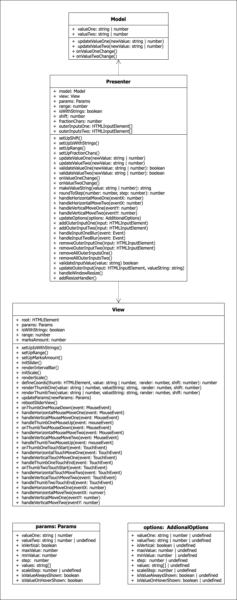

# Slider - JQuery плагин, реализующий функционал "бегунка".

## Описание архитектуры

Приложение построено по паттерну MVP.
###  Model
Этот слой представлен классом Model и работает с данными, коими в приложении являются значения, отбражаемые соответствующим положением ползунков на слайдере. Слайдер работает как с одним значением, так и с двумя. Значения могут представлять из себя числа из заданного диапазона или строки из указанного набора строк. Слой хранит значения и их обговляет. Не имеет зависимостей от других слоёв.

### View
Этот слой представлен классом View. Он отрисовывает интерфейс приложения на странице, управляет отображением данных и реагирует на действия пользователя. Не имеет зависимости от других слоёв приложения. В качестве параметров принимает элемент-контейнер для слайдера и объект с заданными для него опциями.

## Licence & copyright

© Pavel Lashuk
